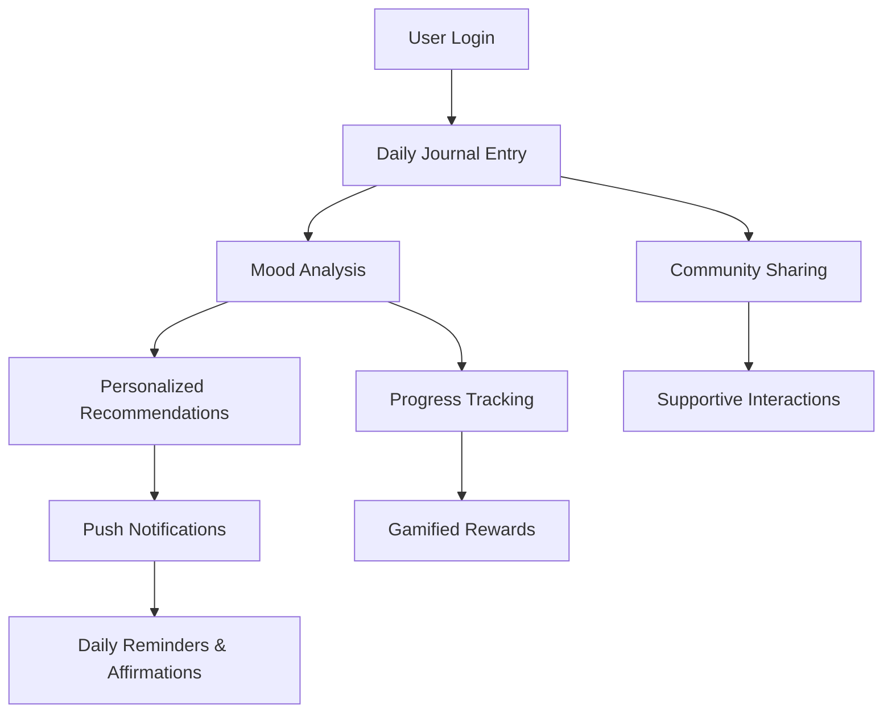
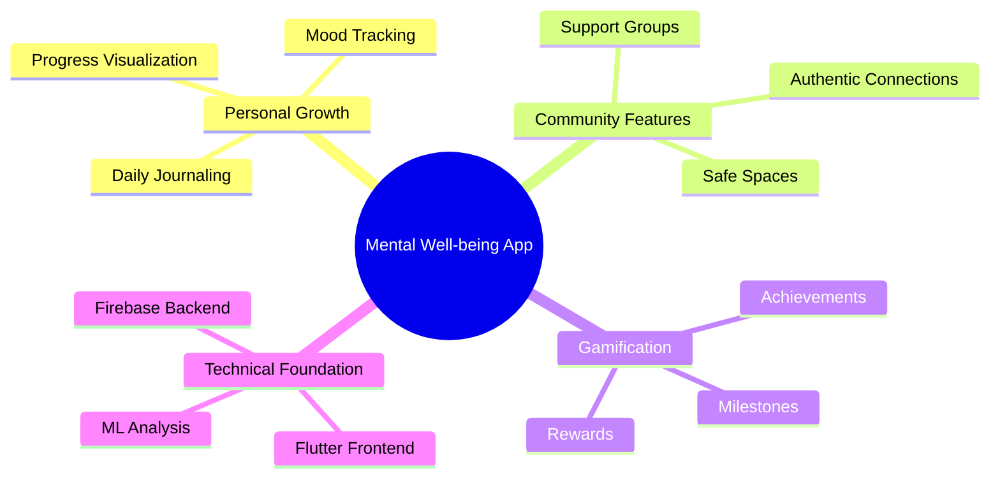

# EmotionalDamage-9-SUSTAIN-AI-THON

## Brief Intro
A revolutionary mental well-being platform that combines personal journaling, mood analysis, and supportive community features. Our app creates a safe digital space where users can focus on personal growth, track their mental well-being journey, and connect authentically with others without the pressures of traditional social media metrics.

## Workflow Diagram

## Concept Map

## Tech Stack
### Frontend Development
- **Framework**: Flutter
  - Cross-platform UI development
  - Responsive design widgets
  - State management solutions
  - Smooth animations

### Backend Infrastructure
- **Platform**: Firebase
  - Authentication
  - Firestore Database
  - Cloud Storage
  - Cloud Messaging
  - Analytics
  - Cloud Functions
  - Remote Config

## Novelty
Our platform stands out through:
1. **AI-Powered Mood Analysis**: Real-time sentiment analysis of journal entries
2. **Growth-Focused Gamification**: Rewards system centered on personal development
3. **Safe Community Design**: Innovative approach to social interactions without traditional metrics
4. **Personalized Well-being Journey**: Adaptive content and recommendations
5. **Seamless Cross-Platform Experience**: Consistent experience across devices

## Solution
### Problem Addressed
Modern social media platforms often contribute to:
- User anxiety and isolation
- Unhealthy comparison behaviors
- Superficial connections
- Mental health deterioration

### Our Approach
1. **Daily Reflection & Journaling**
   - Structured journaling prompts
   - Mood trend analysis
   - Progress visualization

2. **Community Features**
   - Support-focused interactions
   - Shared growth experiences
   - Moderated safe spaces

3. **Technical Implementation**
   - Real-time data synchronization
   - Secure user authentication
   - Private data encryption
   - Scalable cloud infrastructure

## Others
### Installation
[Coming soon]

### Development Setup
1. Flutter environment setup
2. Firebase project configuration
3. API key configuration
4. Local development guidelines

### Contributing
[Guidelines to be added]

### Security
- End-to-end encryption for private data
- Regular security audits
- Compliance with data protection regulations

### Future Roadmap
1. Advanced ML features
2. Group therapy integration
3. Professional counselor network
4. Expanded language support

### Support
- Technical support contact
- Community guidelines
- User documentation

### License
[To be determined]
